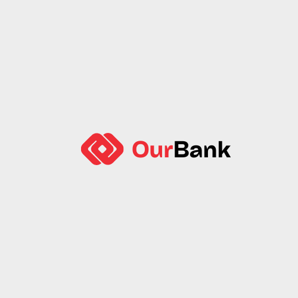

# Fintech Crypto Bank



## Project Duration: 2 weeks

### Project Structure

```bash
OurBank/
├── ourbank.py
├── backend/
│   ├── banking_account.py
│   └── solidity/
│       ├── files/
│       │   ├── contracts/
│       │   │   ├── ethConvert_abi.json
│       │   │   └── ganache_abi.json
│       │   ├── crypto_wallet.py
│       │   ├── ethConvert.sol
│       │   └── wallet.sol
└── frontend/
    └── pages/
        ├── home.py
        ├── account.py
        ├── features.py
        └── about.py

## Task Mandate

### Person 1: Mongodb Database and Data Model Design
- Setting up the MongoDB database and creating data models to ensure proper structure.

### Person 2: Account Creation and Authentication
- Focuses on user registration, login, and authentication, ensuring secure user management.

### Person 3: Crypto Wallet
- Develops the crypto wallet functionality.

### Person 4: Blockchain/Smart Contract Support
- Develops and integrates blockchain/smart contract support.

## Collective Effort
The project requires collaborative effort, so don't hesitate to ask for clarification when needed. Utilize classwork codes or online resources (Slack, YouTube, ChatGPT) to generate baseline code.

## Frontend Development
For this project, a Streamlit frontend will be utilized.

**Project Overview: Our Bank - A Comprehensive Digital Banking Solution**

Our team is proud to present Our Bank, a digital banking platform designed to deliver a seamless and secure banking experience to users. Leveraging a sophisticated technology stack, including Python, Solidity smart contracts, Ganache, Sepolia, and MongoDB, we have developed a feature-rich platform encompassing a login system, bank account, crypto wallet, currency conversion, stock purchasing, and more.

**Key Features:**

1. **Login Feature:** Our platform offers a login system, ensuring secure access to user accounts and banking services.

2. **Bank Account:** Users can efficiently manage their bank accounts through our intuitive interface, facilitating deposit, withdraw, and transfer transactions as well as balance inquiries.

3. **Crypto Wallet Integration:** Seamlessly integrated with the platform, our crypto wallet enables users to store, transfer, and manage various cryptocurrencies securely. The wallet supports Ether and other digital assets, allowing for smooth transactions within the platform.

4. **Currency Conversion and Stock Trading:** Our platform provides advanced functionality for currency conversion and stock trading. Users can convert Ether to other currencies and purchase stocks using cryptocurrency, with real-time updates to their account balances.

5. **Integration with Bank Accounts:** Transactions conducted through the crypto wallet are seamlessly integrated with users' bank accounts. Whether purchasing stocks with Ether or USD, users' account balances are updated instantly for accurate financial management.

6. **About Page:** To provide transparency and insight into our team, Our Bank features an informative About page detailing the individuals involved in its development.

**Technology Stack:**
- **Python:** Utilized for backend development and integration of various features, including the login system and bank account management.
- **Solidity Smart Contracts:** Implemented for secure and efficient execution of transactions within the Ethereum blockchain, powering the crypto wallet functionality.
- **Ganache:** Employed for local testing and simulation of the crypto wallet, facilitating smooth development and testing of Ethereum-based functionalities.
- **Sepolia and MongoDB:** Integrated into the platform to provide robust database management capabilities, ensuring efficient storage and retrieval of user data.

Our Bank represents the culmination of our team's dedication to innovation and excellence in digital banking. By harnessing cutting-edge technologies and a collaborative development approach, we have created a platform that sets new standards for usability and functionality in the financial services industry.


